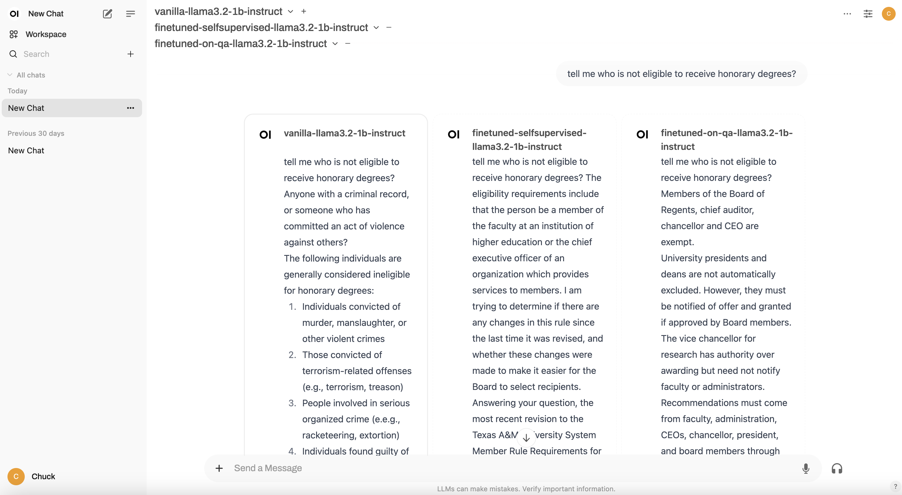
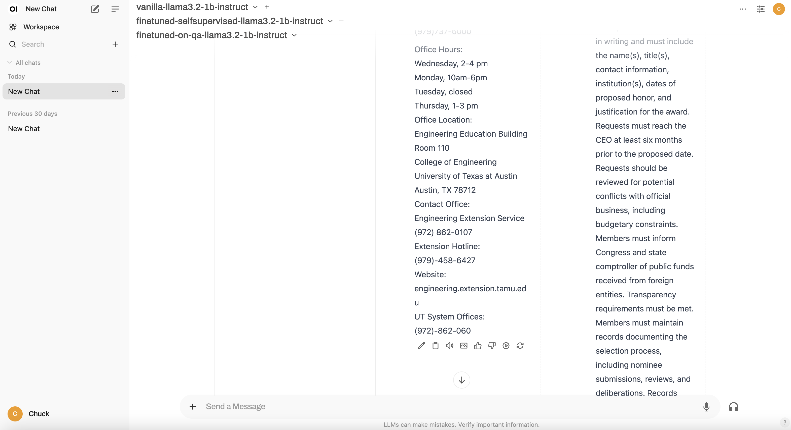

# Finetuning for TAMU-AI

Finetuning allows you to train your own models with your own data. The two majority finetuning methods include self-supervised learning and supervised learning. This project provides finetuning scripts with calling the service of Coiled and utilizing the GPU resources from GCP.

This project also includes finetuning Large Language Models (LLMs) on custom datasets using distributed training with Coiled.

## Features

- Self-supervised finetuning using custom text data
- Question-answering (QA) finetuning with instruction data
- Distributed training support via Coiled
- Automatic checkpoint management and model saving
- Google Cloud Storage (GCS) integration for data and model storage
- Support for resuming training from checkpoints

## Getting Started

### Prerequisites

Ensure that you have the following installed:

- **[Open-webUI](https://openwebui.com/)**: The web interface for managing and interacting with your models.
- **[Coiled](https://coiled.io/)**: A platform for managing and scaling your GPU resources.
- **[GCP](https://cloud.google.com/)**: A cloud platform for hosting your models and data.
- **[Hugging Face](https://huggingface.co/)**: A platform for downloading vanilla models.
- **[Python](https://www.python.org/) 3.11+**: This project requires Python 3.11+ to run smoothly. Currently, the project is tested with Python 3.12 and MacOS.

### Download Repository and Install Required Dependencies

Clone the repository and navigate to the project directory:

```bash
git clone https://github.com/tamu-edu/TAMUAI-Finetuning.git
cd TAMUAI-Finetuning
```

Install the required dependencies:

```bash
pip install -r requirements.txt
```

### Data Preparation

Data cleaning is a crucial first step in the finetuning process. The cleaned datasets should be placed in the 'Finetune/data/processed' directory. For example, with the SAPs dataset:

- For self-supervised learning: Clean and save as 'SAPs_data.json'
- For supervised learning: Process into QA pairs and save as 'qa_pairs.json'

Both files should be placed in the 'Finetune/data/processed/SAPs' directory.

## Finetuning Process

### 1. Set Up Environment

First, you need to set up the Coiled environment and authenticate:

```bash
# Install and set up Coiled
pip install coiled
coiled login

# Create Coiled environment
python create_coiled_environment.py
```

Note: The cluster setup will be handled automatically when running the finetuning scripts. You don't need to manage it manually.

### 2. Choose Finetuning Method

#### Self-supervised Finetuning
For self-supervised learning using your text data:

```bash
python finetune_self_supervised.py --num-epochs 10
```

To resume from a checkpoint:
```bash
python finetune_self_supervised.py --resume-checkpoint checkpoint-32 --num-epochs 15
```

#### Supervised (QA) Finetuning
For supervised learning using question-answer pairs:

```bash
python finetune_on_qa.py --num-epochs 10
```

To resume from a checkpoint:
```bash
python finetune_on_qa.py --resume-checkpoint checkpoint-32 --num-epochs 15
```

### 3. Model Storage Structure

Models and checkpoints are automatically saved to GCS in the following structure:

```
gs://your-bucket/
├── vanilla_models/              # Base models
├── finetuned_models/
    ├── model_name/
        ├── self_supervised_checkpoints/
        ├── self_supervised_best/
        ├── self_supervised_final/
        ├── qa_checkpoints/
        ├── qa_best/
        └── qa_final/
```

### Finetuned Results





## What's Next?

Additional features and improvements are under development. Stay tuned for future updates!

---

Created by [Chuck Zuo, Ph.D.](https://github.com/dkflameEDU) - Let's make TAMU-AI great together!
